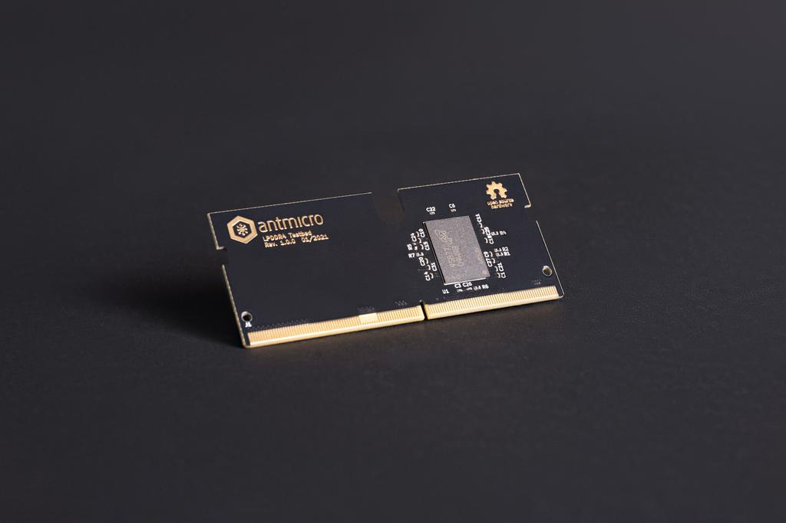

LPDDR4 testbed
==============

Copyright (c) 2020-2021 [Antmicro](https://www.antmicro.com)

Overview
--------

This repository contains open hardware design files for an experimental
test module in a form of SO-DIMM DDR4 module. The module includes a
standard 200-ball WFBGA (10mm × 14.5mm × 0.8mm, Ø0.35 SMD) LPDDR4 RAM
footprint break-routed in the SO-DOMM edge connector. The design files
were prepared in KiCad. Please note that this board is not electrically
compatible with off-the-shelf SO-DIMM DDR4 memory modules. It is
compatible with [this](https://github.com/antmicro/lpddr4-test-board)
LPDDR4 test platform.

Repository structure
--------------------

The main repository directory contains KiCad PCB project files, a
LICENSE and README. The remaining files are stored in the following
directories:

-   `lib` - contains the component libraries
-   `img` - contains graphics for this README

### License

[Apache-2.0](LICENSE)
